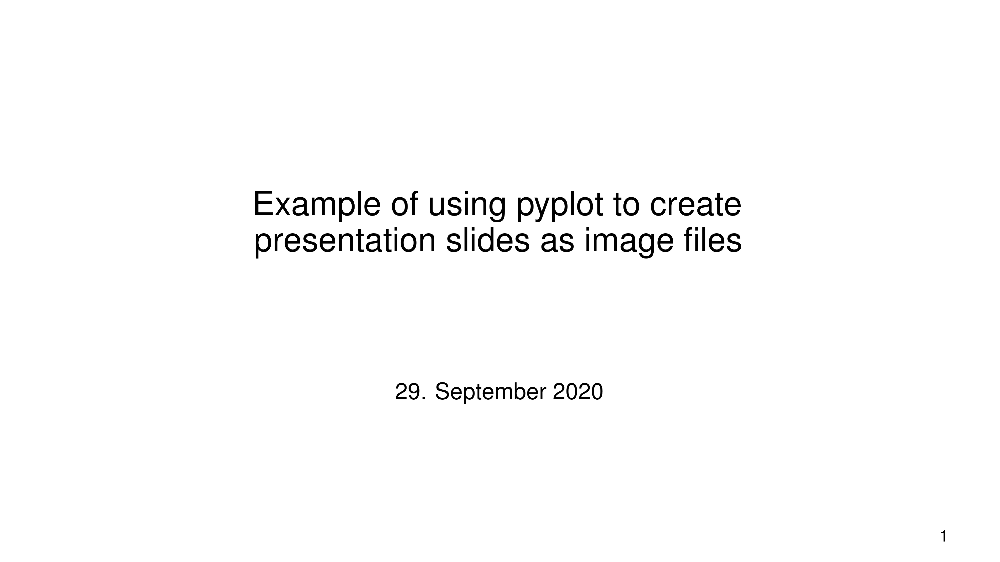
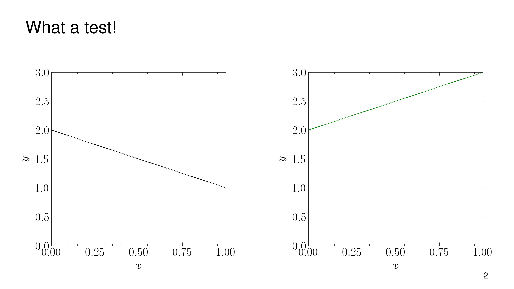
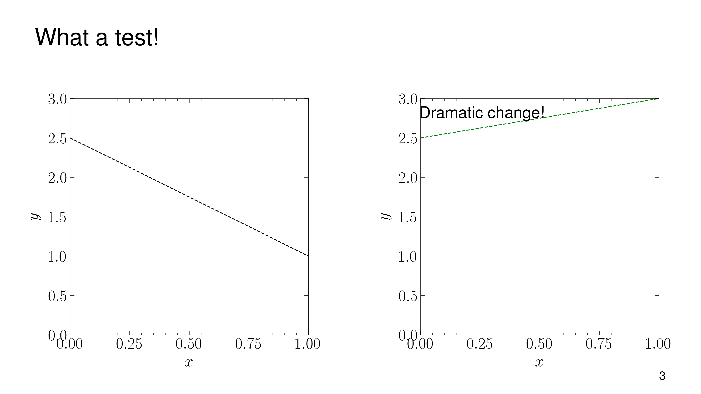
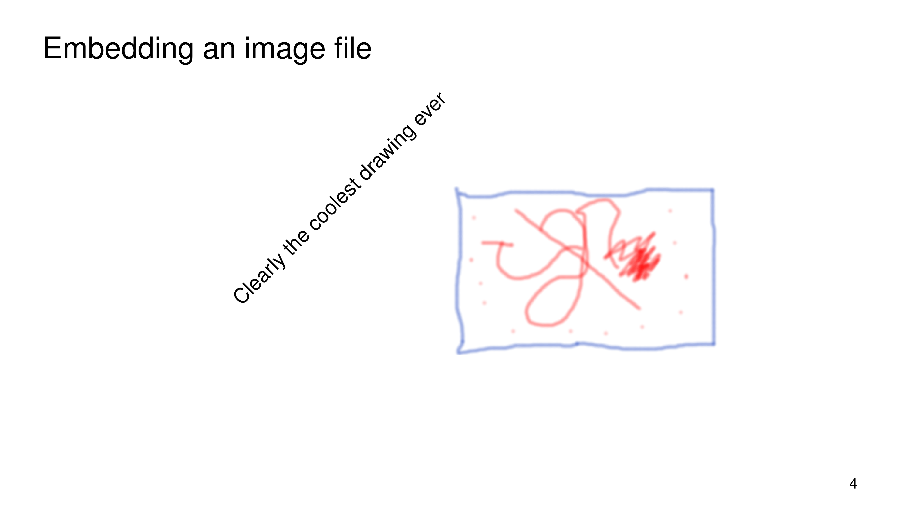

# pysentation
Create presentation slides with pyplot

Inspired by 3b1b/manim

The class pysentation.presentation helps to create presentation slides as images, plotted using pyplot. 
This approach provides the flexibility of powerpoint, while running on Linux and anywhere else (yay for python). 
I often see Linux users using LaTeX beamer for presentations, but when I tried that, I had to bend over backwards to freely arange plots on the slide or draw annotations around notable features. 
With pyplot, these sorts of stunts are about as easy as in powerpoint, and more robust.

An example:

<kbd></kbd>
<kbd></kbd>
<kbd></kbd>
<kbd></kbd>

